<div align="center">

# Krydo — Technical Documentation

**Architecture · Protocols · Data flows · Security · Deployment**

</div>

> This document is the companion to the project [`README.md`](./README.md).
> The README is the marketing / quick-start surface; this file is the engineering spec.
> Every diagram below is rendered natively on GitHub (Mermaid).

---

## Table of contents

1. [System overview](#1-system-overview)
2. [Trust hierarchy](#2-trust-hierarchy)
3. [Smart-contract architecture](#3-smart-contract-architecture)
4. [Repository layout](#4-repository-layout)
5. [Authentication — Sign-in-with-Stellar + JWT](#5-authentication--sign-in-with-stellar--jwt)
6. [Credential request lifecycle](#6-credential-request-lifecycle)
7. [Credential issuance flow](#7-credential-issuance-flow)
8. [Credential state machine](#8-credential-state-machine)
9. [Zero-knowledge proof system](#9-zero-knowledge-proof-system)
10. [ZK proof generation](#10-zk-proof-generation)
11. [ZK proof verification](#11-zk-proof-verification)
12. [Sigma protocol internals](#12-sigma-protocol-internals)
13. [On-chain vs off-chain data](#13-on-chain-vs-off-chain-data)
14. [Audit event anchoring](#14-audit-event-anchoring)
15. [API surface](#15-api-surface)
16. [Security layers](#16-security-layers)
17. [Deployment topology](#17-deployment-topology)
18. [Observability & operations](#18-observability--operations)

---

## 1. System overview

Krydo is a three-tier trust network sitting on top of the Stellar network (Soroban smart contracts on Stellar Testnet), backed by a Node/Express API and a React SPA. The client never talks to Firestore directly; every read/write is mediated by the server. **Every mutation that must be auditable on-chain is signed by the acting user's wallet** after an in-app confirm dialog. The server `DEPLOYER_SECRET` is used to deploy contracts, identify the root authority, and simulate/read RPC calls — not to sign issuer/holder transactions.

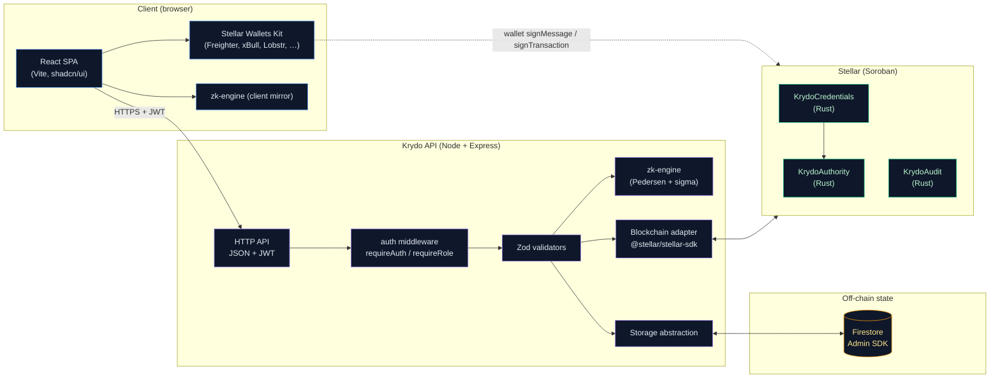
```mermaid
flowchart LR
    subgraph Client["Client (browser)"]
        UI["React SPA<br/>(Vite, shadcn/ui)"]
        KIT["Stellar Wallets Kit<br/>(Freighter, xBull, Lobstr, …)"]
        ZKC["zk-engine (client mirror)"]
        UI --> KIT
        UI --> ZKC
    end

    subgraph Server["Krydo API (Node + Express)"]
        API["HTTP API<br/>JSON + JWT"]
        AUTHM["auth middleware<br/>requireAuth / requireRole"]
        VAL["Zod validators"]
        ZKE["zk-engine<br/>(Pedersen + sigma)"]
        STORE["Storage abstraction"]
        BC["Blockchain adapter<br/>@stellar/stellar-sdk"]
        API --> AUTHM --> VAL
        VAL --> ZKE
        VAL --> STORE
        VAL --> BC
    end

    subgraph Data["Off-chain state"]
        FS[("Firestore<br/>Admin SDK")]
    end

    subgraph Chain["Stellar (Soroban)"]
        KA["KrydoAuthority<br/>(Rust)"]
        KC["KrydoCredentials<br/>(Rust)"]
        KAU["KrydoAudit<br/>(Rust)"]
        KC --> KA
    end

    UI -- "HTTPS + JWT" --> API
    KIT -. "wallet signMessage / signTransaction" .-> Chain
    STORE <--> FS
    BC <--> Chain

    classDef client fill:#0f172a,stroke:#60a5fa,color:#e2e8f0
    classDef server fill:#0f172a,stroke:#a78bfa,color:#e2e8f0
    classDef data fill:#0f172a,stroke:#f59e0b,color:#fde68a
    classDef chain fill:#0f172a,stroke:#10b981,color:#bbf7d0
    class UI,KIT,ZKC client
    class API,AUTHM,VAL,ZKE,STORE,BC server
    class FS data
    class KA,KC,KAU chain
```

### Two request paths

Krydo operates under two complementary paths depending on whether the action produces on-chain state:

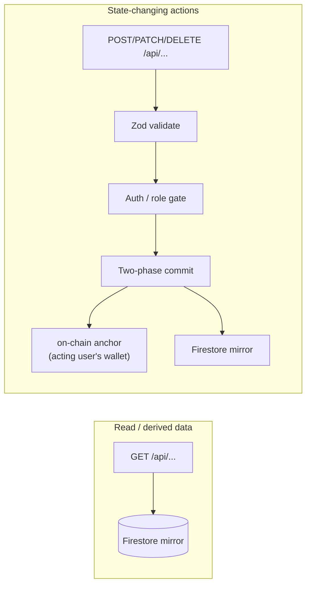
```mermaid
flowchart LR
    subgraph Classical["Read / derived data"]
        R["GET /api/..."] --> DB[("Firestore mirror")]
    end
    subgraph StateChange["State-changing actions"]
        W["POST/PATCH/DELETE /api/..."] --> Z["Zod validate"] --> A["Auth / role gate"] --> T["Two-phase commit"]
        T --> ANC["on-chain anchor<br/>(acting user's wallet)"]
        T --> PST["Firestore mirror"]
    end
```

---

## 2. Trust hierarchy

Krydo deliberately keeps the trust model simple enough to reason about on a whiteboard. There are exactly **four roles** and exactly **one direction of trust**: no role can elevate itself, and no role downstream of another can forge credentials on its behalf.

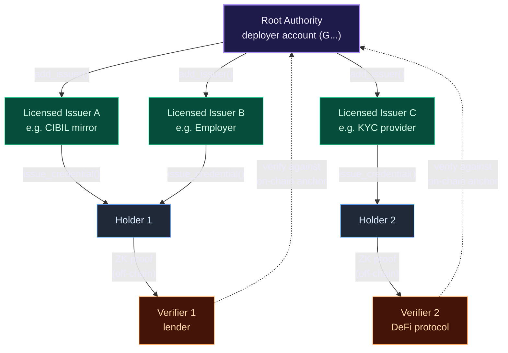
```mermaid
flowchart TB
    ROOT["Root Authority<br/>deployer account (G...)"]
    ISS1["Licensed Issuer A<br/>e.g. CIBIL mirror"]
    ISS2["Licensed Issuer B<br/>e.g. Employer"]
    ISS3["Licensed Issuer C<br/>e.g. KYC provider"]
    H1["Holder 1"]
    H2["Holder 2"]
    V1["Verifier 1<br/>lender"]
    V2["Verifier 2<br/>DeFi protocol"]

    ROOT -- "add_issuer()" --> ISS1
    ROOT -- "add_issuer()" --> ISS2
    ROOT -- "add_issuer()" --> ISS3

    ISS1 -- "issue_credential()" --> H1
    ISS2 -- "issue_credential()" --> H1
    ISS3 -- "issue_credential()" --> H2

    H1 -- "ZK proof<br/>(off-chain)" --> V1
    H2 -- "ZK proof<br/>(off-chain)" --> V2

    V1 -. "verify against<br/>on-chain anchor" .-> ROOT
    V2 -. "verify against<br/>on-chain anchor" .-> ROOT

    classDef root fill:#1e1b4b,stroke:#a78bfa,color:#ede9fe,stroke-width:2px
    classDef issuer fill:#064e3b,stroke:#34d399,color:#d1fae5
    classDef holder fill:#1f2937,stroke:#60a5fa,color:#dbeafe
    classDef verifier fill:#431407,stroke:#fb923c,color:#fed7aa
    class ROOT root
    class ISS1,ISS2,ISS3 issuer
    class H1,H2 holder
    class V1,V2 verifier
```

### Role capabilities

| Role        | Can do                                               | Cannot do                                  |
|-------------|------------------------------------------------------|--------------------------------------------|
| Root        | Add / revoke issuers, revoke any credential          | Forge credentials (would need issuer key)  |
| Issuer      | Issue / revoke credentials they signed               | Issue on behalf of another issuer          |
| Holder      | Accept credentials, generate ZK proofs, revoke own   | Mint credentials, whitelist issuers        |
| Verifier    | Verify shared proofs, inspect public anchors         | Read holder PII; see underlying values     |

`GET /api/issuers` prefers the live `KrydoAuthority` whitelist (`get_issuers` / `get_issuer_info`) when the chain is readable, and upserts/mirrors those rows into Firestore. Legacy non-Stellar (`0x…`) issuer rows are filtered out.

---

## 3. Smart-contract architecture

Three contracts, a small Soroban (Rust) Cargo workspace under `contracts/` (crates: `authority/`, `credentials/`, `audit/`). Intentionally minimal — complex logic lives off-chain where it's cheaper to iterate on.

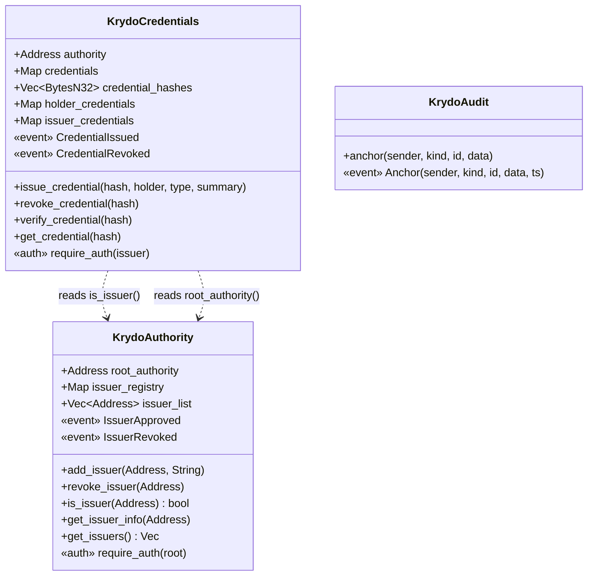
```mermaid
classDiagram
    class KrydoAuthority {
        +Address root_authority
        +Map issuer_registry
        +Vec~Address~ issuer_list
        +add_issuer(Address, String)
        +revoke_issuer(Address)
        +is_issuer(Address) bool
        +get_issuer_info(Address)
        +get_issuers() Vec
        «auth» require_auth(root)
        «event» IssuerApproved
        «event» IssuerRevoked
    }
    class KrydoCredentials {
        +Address authority
        +Map credentials
        +Vec~BytesN32~ credential_hashes
        +Map holder_credentials
        +Map issuer_credentials
        +issue_credential(hash, holder, type, summary)
        +revoke_credential(hash)
        +verify_credential(hash)
        +get_credential(hash)
        «auth» require_auth(issuer)
        «event» CredentialIssued
        «event» CredentialRevoked
    }
    class KrydoAudit {
        +anchor(sender, kind, id, data)
        «event» Anchor(sender, kind, id, data, ts)
    }
    KrydoCredentials ..> KrydoAuthority : reads is_issuer()
    KrydoCredentials ..> KrydoAuthority : reads root_authority()
```

### Fee profile

Soroban charges Stellar network fees rather than per-opcode gas. In practice each contract call costs a small fraction of a cent, and read-only calls (`is_issuer`, `get_credential`, `verify_credential`) are served by RPC simulation and cost nothing. Contract deploys (upload + create) and state-changing calls (`add_issuer`, `issue_credential`, `revoke_credential`, `anchor`) each pay a sub-cent inclusion + resource fee. Amounts are denominated in stroops (1 XLM = 10⁷ stroops); the deployer account is funded with testnet XLM via [friendbot](https://friendbot.stellar.org).

### Why a separate `KrydoAudit` contract?

Rather than scatter ad-hoc payload-carrying transactions, Krydo routes holder-signed anchor events (credential requests, ZK proof anchors, role assignments) through a minimal state-free contract call. This turns them into first-class Soroban transactions the wallet (via Stellar Wallets Kit) will sign and simulate normally, and gives every off-chain action a uniform on-chain provenance record. The contract stores nothing; it just emits an `Anchor(sender, kind, id, data, timestamp)` event indexed for cheap queries.

---

## 4. Repository layout

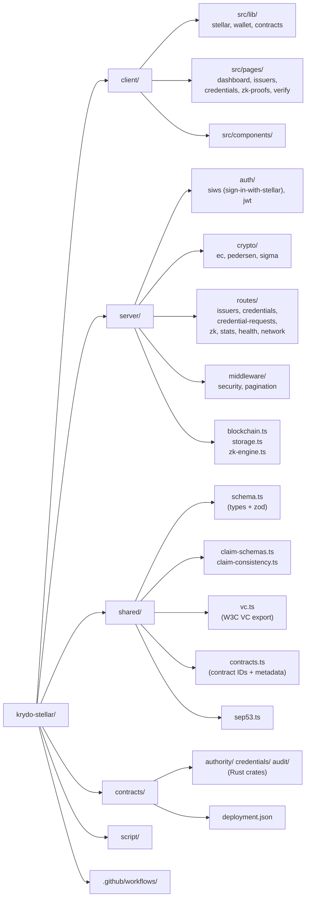
```mermaid
flowchart LR
    ROOT["krydo-stellar/"]
    ROOT --> CLIENT["client/"]
    ROOT --> SERVER["server/"]
    ROOT --> SHARED["shared/"]
    ROOT --> CONTRACTS["contracts/"]
    ROOT --> SCRIPT["script/"]
    ROOT --> CI[".github/workflows/"]

    CLIENT --> CLI_LIB["src/lib/<br/>stellar, wallet, contracts"]
    CLIENT --> CLI_PAGES["src/pages/<br/>dashboard, issuers,<br/>credentials, zk-proofs, verify"]
    CLIENT --> CLI_COMP["src/components/"]

    SERVER --> SRV_AUTH["auth/<br/>siws (sign-in-with-stellar), jwt"]
    SERVER --> SRV_CRYPTO["crypto/<br/>ec, pedersen, sigma"]
    SERVER --> SRV_ROUTES["routes/<br/>issuers, credentials,<br/>credential-requests,<br/>zk, stats, health, network"]
    SERVER --> SRV_MIDDLE["middleware/<br/>security, pagination"]
    SERVER --> SRV_MISC["blockchain.ts<br/>storage.ts<br/>zk-engine.ts"]

    SHARED --> S_SCHEMA["schema.ts<br/>(types + zod)"]
    SHARED --> S_CLAIMS["claim-schemas.ts<br/>claim-consistency.ts"]
    SHARED --> S_VC["vc.ts<br/>(W3C VC export)"]
    SHARED --> S_CONT["contracts.ts<br/>(contract IDs + metadata)"]
    SHARED --> S_SEP["sep53.ts"]

    CONTRACTS --> C_SOL["authority/ credentials/ audit/<br/>(Rust crates)"]
    CONTRACTS --> C_JSON["deployment.json"]
```

---

## 5. Authentication — Sign-in-with-Stellar + JWT

Krydo does not use passwords or OAuth. Every authenticated session is bootstrapped by a Stellar account signing a canonical challenge message over a server-issued nonce — Sign-in-with-Stellar (SIWS). The wallet signs per SEP-53 with the account's ed25519 key; the server verifies with `verifySep53Message` (not raw `Keypair.verify` on UTF-8), then issues a short-lived JWT whose `sub` is the StrKey account address (`G...`, 56 chars, case-sensitive). When contracts are live and the user's role is new or never anchored, the client then confirms a `KrydoAudit.anchor` role event and records it via `POST /api/auth/role-anchor`.

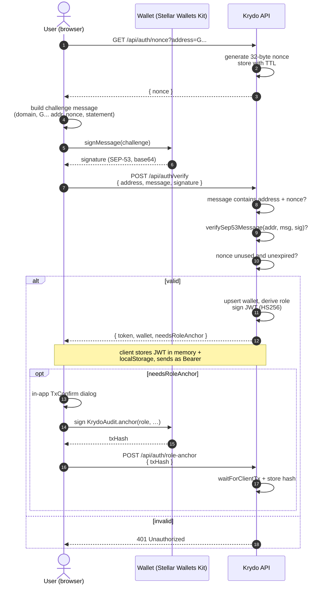
```mermaid
sequenceDiagram
    autonumber
    actor U as User (browser)
    participant W as Wallet (Stellar Wallets Kit)
    participant S as Krydo API

    U->>S: GET /api/auth/nonce?address=G...
    S->>S: generate 32-byte nonce<br/>store with TTL
    S-->>U: { nonce }
    U->>U: build challenge message<br/>(domain, G... addr, nonce, statement)
    U->>W: signMessage(challenge)
    W-->>U: signature (SEP-53, base64)
    U->>S: POST /api/auth/verify<br/>{ address, message, signature }
    S->>S: message contains address + nonce?
    S->>S: verifySep53Message(addr, msg, sig)?
    S->>S: nonce unused and unexpired?
    alt valid
        S->>S: upsert wallet, derive role<br/>sign JWT (HS256)
        S-->>U: { token, wallet, needsRoleAnchor }
        Note over U,S: client stores JWT in memory +<br/>localStorage, sends as Bearer
        opt needsRoleAnchor
            U->>U: in-app TxConfirm dialog
            U->>W: sign KrydoAudit.anchor(role, …)
            W-->>U: txHash
            U->>S: POST /api/auth/role-anchor<br/>{ txHash }
            S->>S: waitForClientTx + store hash
        end
    else invalid
        S-->>U: 401 Unauthorized
    end
```

### JWT shape

```
header  { alg: "HS256", typ: "JWT" }
payload { sub: "G...", role: "root|issuer|user", iat, exp }
```

### Middleware chain applied to every protected route

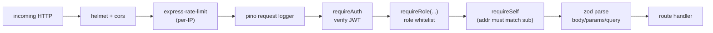
```mermaid
flowchart LR
    REQ["incoming HTTP"] --> HEL["helmet + cors"]
    HEL --> RL["express-rate-limit<br/>(per-IP)"]
    RL --> LOG["pino request logger"]
    LOG --> AUTH["requireAuth<br/>verify JWT"]
    AUTH --> ROLE["requireRole(...)<br/>role whitelist"]
    ROLE --> SELF["requireSelf<br/>(addr must match sub)"]
    SELF --> ZOD["zod parse<br/>body/params/query"]
    ZOD --> HNDLR["route handler"]
```

---

## 6. Credential request lifecycle

A holder asking for a credential goes through a finite-state machine. The holder must confirm in-app and sign an on-chain audit anchor so the issuer never sees an un-consented request, and gets a 1-click escape hatch (wallet cancel → server DELETE rollback).

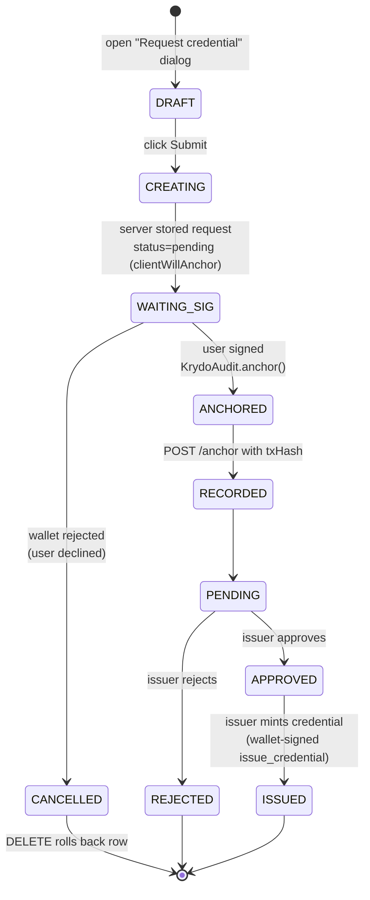
```mermaid
stateDiagram-v2
    [*] --> DRAFT: open "Request credential" dialog
    DRAFT --> CREATING: click Submit
    CREATING --> WAITING_SIG: server stored request<br/>status=pending (clientWillAnchor)
    WAITING_SIG --> CANCELLED: wallet rejected<br/>(user declined)
    CANCELLED --> [*]: DELETE rolls back row
    WAITING_SIG --> ANCHORED: user signed<br/>KrydoAudit.anchor()
    ANCHORED --> RECORDED: POST /anchor with txHash
    RECORDED --> PENDING
    PENDING --> APPROVED: issuer approves
    PENDING --> REJECTED: issuer rejects
    APPROVED --> ISSUED: issuer mints credential<br/>(wallet-signed issue_credential)
    REJECTED --> [*]
    ISSUED --> [*]
```

### Sequence view

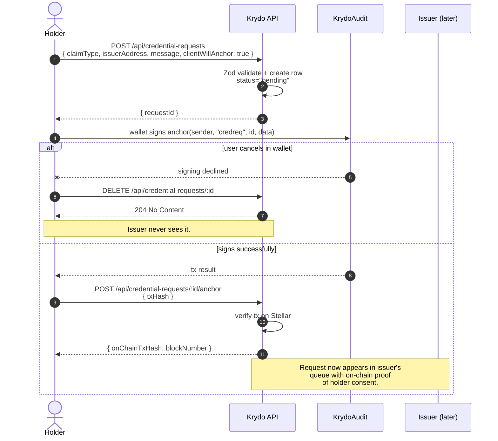
```mermaid
sequenceDiagram
    autonumber
    actor H as Holder
    participant API as Krydo API
    participant AUD as KrydoAudit
    participant I as Issuer (later)

    H->>API: POST /api/credential-requests<br/>{ claimType, issuerAddress, message, clientWillAnchor: true }
    API->>API: Zod validate + create row<br/>status="pending"
    API-->>H: { requestId }

    H->>AUD: wallet signs anchor(sender, "credreq", id, data)
    alt user cancels in wallet
        AUD--xH: signing declined
        H->>API: DELETE /api/credential-requests/:id
        API-->>H: 204 No Content
        Note over H,API: Issuer never sees it.
    else signs successfully
        AUD-->>H: tx result
        H->>API: POST /api/credential-requests/:id/anchor<br/>{ txHash }
        API->>API: verify tx on Stellar
        API-->>H: { onChainTxHash, blockNumber }
        Note over API,I: Request now appears in issuer's<br/>queue with on-chain proof<br/>of holder consent.
    end
```

---

## 7. Credential issuance flow

Once a request is approved (or an issuer issues directly), the credential is minted **wallet-first**. The issuer confirms in-app, signs `KrydoCredentials.issue_credential()` in their wallet, then the API stores the Firestore row with the real `onChainTxHash`. Approving a pending request can use a prepare/finalize handshake (`prepareOnly` → wallet sign → `finalize` + `onChainTxHash`). There is no server-signed issuance path when contracts are configured — missing `onChainTxHash` returns HTTP 400. `PATCH /api/credentials/:id/tx` re-attaches a confirmed hash after a retry.

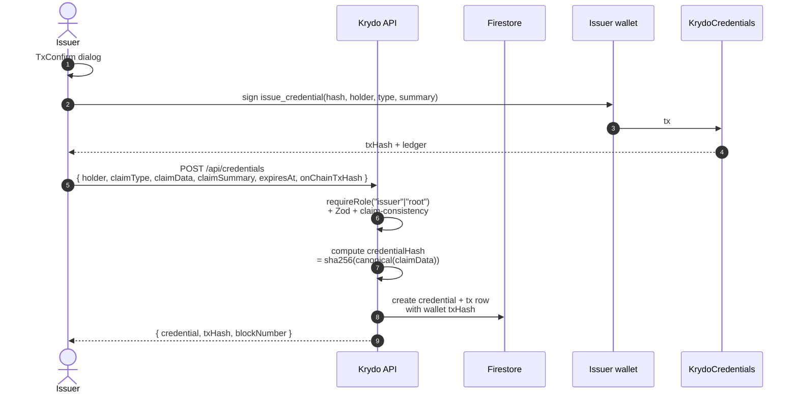
```mermaid
sequenceDiagram
    autonumber
    actor I as Issuer
    participant API as Krydo API
    participant FS as Firestore
    participant W as Issuer wallet
    participant KC as KrydoCredentials

    I->>I: TxConfirm dialog
    I->>W: sign issue_credential(hash, holder, type, summary)
    W->>KC: tx
    KC-->>I: txHash + ledger
    I->>API: POST /api/credentials<br/>{ holder, claimType, claimData, claimSummary, expiresAt, onChainTxHash }
    API->>API: requireRole("issuer"|"root")<br/>+ Zod + claim-consistency
    API->>API: compute credentialHash<br/>= sha256(canonical(claimData))
    API->>FS: create credential + tx row<br/>with wallet txHash
    API-->>I: { credential, txHash, blockNumber }
```

### Claim data validation

`claimData` is validated against a per-type Zod schema before hashing, so an `income_verification` credential is guaranteed to carry `{ amount: number, currency: "INR"|..., ...}` and not arbitrary JSON. The UI often sends `{ value }`; `coerceUiClaimData` maps that into the structured shape. Separately, `validateIssuerClaimInputs` in [`shared/claim-consistency.ts`](./shared/claim-consistency.ts) rejects mismatches such as summary “above 750” with numeric value `742`, and enforces credit-score bounds (300–900).

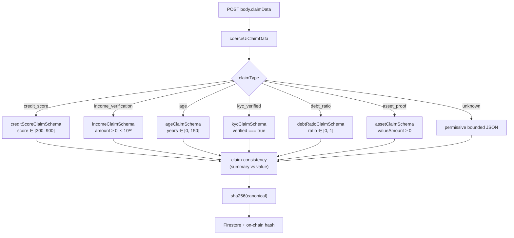
```mermaid
flowchart TB
    IN["POST body.claimData"]
    IN --> COERCE["coerceUiClaimData"]
    COERCE --> SW{"claimType"}
    SW -->|credit_score| CS["creditScoreClaimSchema<br/>score ∈ [300, 900]"]
    SW -->|income_verification| INC["incomeClaimSchema<br/>amount ≥ 0, ≤ 10¹²"]
    SW -->|age| AG["ageClaimSchema<br/>years ∈ [0, 150]"]
    SW -->|kyc_verified| KYC["kycClaimSchema<br/>verified === true"]
    SW -->|debt_ratio| DR["debtRatioClaimSchema<br/>ratio ∈ [0, 1]"]
    SW -->|asset_proof| AS["assetClaimSchema<br/>valueAmount ≥ 0"]
    SW -->|unknown| PASS["permissive bounded JSON"]
    CS --> CONS["claim-consistency<br/>(summary vs value)"]
    INC --> CONS
    AG --> CONS
    KYC --> CONS
    DR --> CONS
    AS --> CONS
    PASS --> CONS
    CONS --> HASH["sha256(canonical)"]
    HASH --> STORE["Firestore + on-chain hash"]
```

---

## 8. Credential state machine

Once minted, a credential moves through its own lifecycle. Note that revocation can happen at two layers: the **credential itself** can be revoked, or the **issuer** can be de-whitelisted (which makes every credential they signed untrusted for new proofs, without having to revoke each one individually).

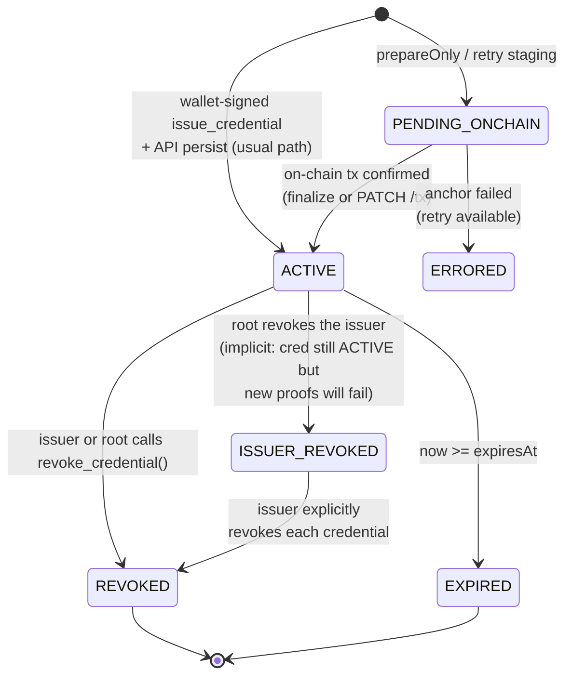
```mermaid
stateDiagram-v2
    [*] --> ACTIVE: wallet-signed issue_credential<br/>+ API persist (usual path)
    [*] --> PENDING_ONCHAIN: prepareOnly / retry staging
    PENDING_ONCHAIN --> ACTIVE: on-chain tx confirmed<br/>(finalize or PATCH /tx)
    PENDING_ONCHAIN --> ERRORED: anchor failed<br/>(retry available)
    ACTIVE --> REVOKED: issuer or root calls revoke_credential()
    ACTIVE --> ISSUER_REVOKED: root revokes the issuer<br/>(implicit: cred still ACTIVE but<br/>new proofs will fail)
    ACTIVE --> EXPIRED: now >= expiresAt
    REVOKED --> [*]
    EXPIRED --> [*]
    ISSUER_REVOKED --> REVOKED: issuer explicitly<br/>revokes each credential
```

### What gates a ZK proof from verifying

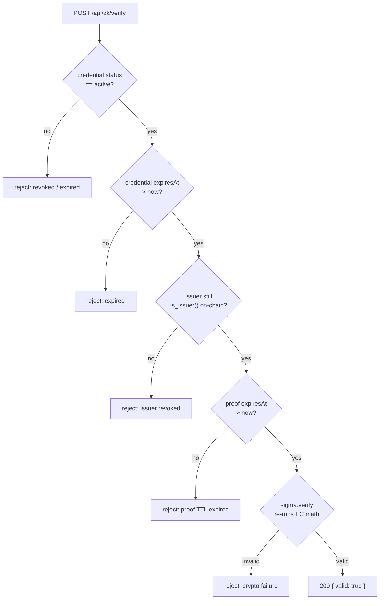
```mermaid
flowchart TD
    V["POST /api/zk/verify"] --> CH1{"credential status<br/>== active?"}
    CH1 -- "no" --> FAIL1["reject: revoked / expired"]
    CH1 -- "yes" --> CH2{"credential expiresAt<br/>> now?"}
    CH2 -- "no" --> FAIL2["reject: expired"]
    CH2 -- "yes" --> CH3{"issuer still<br/>is_issuer() on-chain?"}
    CH3 -- "no" --> FAIL3["reject: issuer revoked"]
    CH3 -- "yes" --> CH4{"proof expiresAt<br/>> now?"}
    CH4 -- "no" --> FAIL4["reject: proof TTL expired"]
    CH4 -- "yes" --> CH5{"sigma.verify<br/>re-runs EC math"}
    CH5 -- "invalid" --> FAIL5["reject: crypto failure"]
    CH5 -- "valid" --> OK["200 { valid: true }"]
```

---

## 9. Zero-knowledge proof system

Krydo uses **sigma protocols** over Pedersen commitments on a prime-order elliptic curve (via `@noble/curves`), made non-interactive via Fiat–Shamir. No circuits, no trusted setup. Six proof types are implemented; see [`server/zk-engine.ts`](./server/zk-engine.ts) and [`server/crypto/sigma.ts`](./server/crypto/sigma.ts).

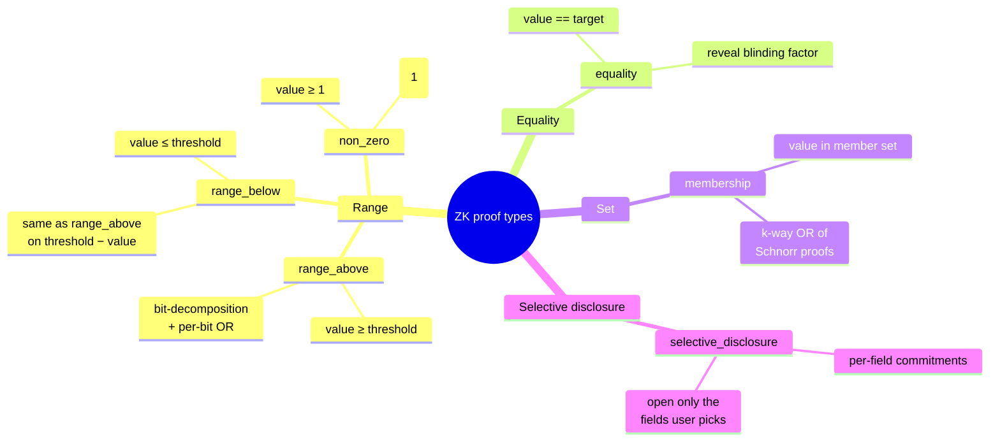
```mermaid
mindmap
  root((ZK proof types))
    Range
      range_above
        value ≥ threshold
        bit-decomposition<br/>+ per-bit OR
      range_below
        value ≤ threshold
        same as range_above<br/>on threshold − value
      non_zero
        value ≥ 1
        reduction to range_above(1)
    Equality
      equality
        value == target
        reveal blinding factor
    Set
      membership
        value in member set
        k-way OR of<br/>Schnorr proofs
    Selective disclosure
      selective_disclosure
        per-field commitments
        open only the<br/>fields user picks
```

### Proof types at a glance

| Proof type             | Prover input                               | Verifier learns                                  | What stays hidden               |
|------------------------|--------------------------------------------|--------------------------------------------------|---------------------------------|
| `range_above`          | `value, blinding, threshold`               | `value ≥ threshold`                              | exact value                     |
| `range_below`          | `value, blinding, threshold`               | `value ≤ threshold`                              | exact value                     |
| `equality`             | `value, blinding, target`                  | `value == target`                                | blinding, nothing else useful   |
| `membership`           | `value, blinding, memberSet`               | `value ∈ memberSet`                              | which member                    |
| `non_zero`             | `value, blinding`                          | `value ≥ 1`                                      | exact value                     |
| `selective_disclosure` | `allFields, selectedFields`                | opened fields verbatim                           | unopened fields                 |

---

## 10. ZK proof generation

Generation is entirely off-chain. The holder never sends their secret to the server — only the commitment and the proof. The API route is a thin wrapper around the engine, plus defense-in-depth validation (no threshold > actual value, no range proofs on non-numeric credentials, etc.).

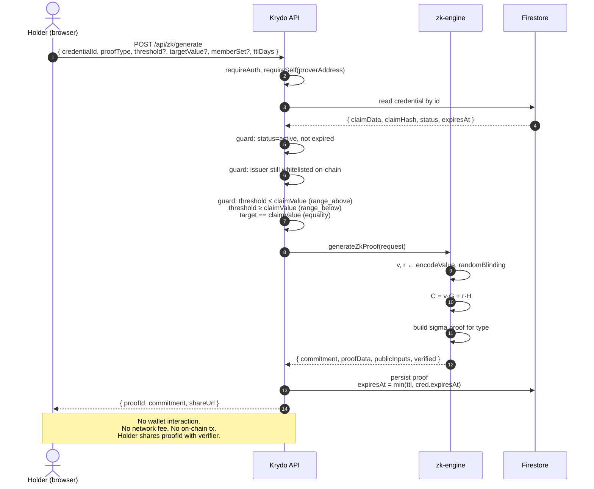
```mermaid
sequenceDiagram
    autonumber
    actor H as Holder (browser)
    participant API as Krydo API
    participant ENG as zk-engine
    participant FS as Firestore

    H->>API: POST /api/zk/generate<br/>{ credentialId, proofType, threshold?, targetValue?, memberSet?, ttlDays }
    API->>API: requireAuth, requireSelf(proverAddress)
    API->>FS: read credential by id
    FS-->>API: { claimData, claimHash, status, expiresAt }

    API->>API: guard: status=active, not expired
    API->>API: guard: issuer still whitelisted on-chain
    API->>API: guard: threshold ≤ claimValue (range_above)<br/>threshold ≥ claimValue (range_below)<br/>target == claimValue (equality)
    API->>ENG: generateZkProof(request)
    ENG->>ENG: v, r ← encodeValue, randomBlinding
    ENG->>ENG: C = v·G + r·H
    ENG->>ENG: build sigma proof for type
    ENG-->>API: { commitment, proofData, publicInputs, verified }
    API->>FS: persist proof<br/>expiresAt = min(ttl, cred.expiresAt)
    API-->>H: { proofId, commitment, shareUrl }

    Note over H,API: No wallet interaction.<br/>No network fee. No on-chain tx.<br/>Holder shares proofId with verifier.
```

### Off-chain design decision

ZK proof generation used to emit an on-chain anchor via `KrydoAudit`. As of `4e44be6` it's pure off-chain:

- Holder doesn't pay Stellar network fees just to share a credential fact.
- The commitment never leaks onto a public chain, improving unlinkability.
- If public audit is desired later, `POST /api/zk/:id/anchor` still exists — the holder can retroactively anchor any proof.

---

## 11. ZK proof verification

Verification is public and does not require authentication. A verifier can call it with just a `proofId` (plus optional `challenge` for freshness).

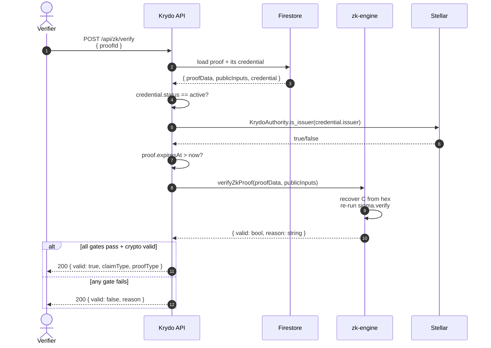
```mermaid
sequenceDiagram
    autonumber
    actor V as Verifier
    participant API as Krydo API
    participant FS as Firestore
    participant ENG as zk-engine
    participant CHAIN as Stellar

    V->>API: POST /api/zk/verify<br/>{ proofId }
    API->>FS: load proof + its credential
    FS-->>API: { proofData, publicInputs, credential }

    API->>API: credential.status == active?
    API->>CHAIN: KrydoAuthority.is_issuer(credential.issuer)
    CHAIN-->>API: true/false
    API->>API: proof.expiresAt > now?
    API->>ENG: verifyZkProof(proofData, publicInputs)
    ENG->>ENG: recover C from hex<br/>re-run sigma.verify
    ENG-->>API: { valid: bool, reason: string }

    alt all gates pass + crypto valid
        API-->>V: 200 { valid: true, claimType, proofType }
    else any gate fails
        API-->>V: 200 { valid: false, reason }
    end
```

---

## 12. Sigma protocol internals

All six proof types reduce to one of three primitive sigma protocols, each a classical three-move commit-challenge-response, collapsed to non-interactive via Fiat–Shamir.

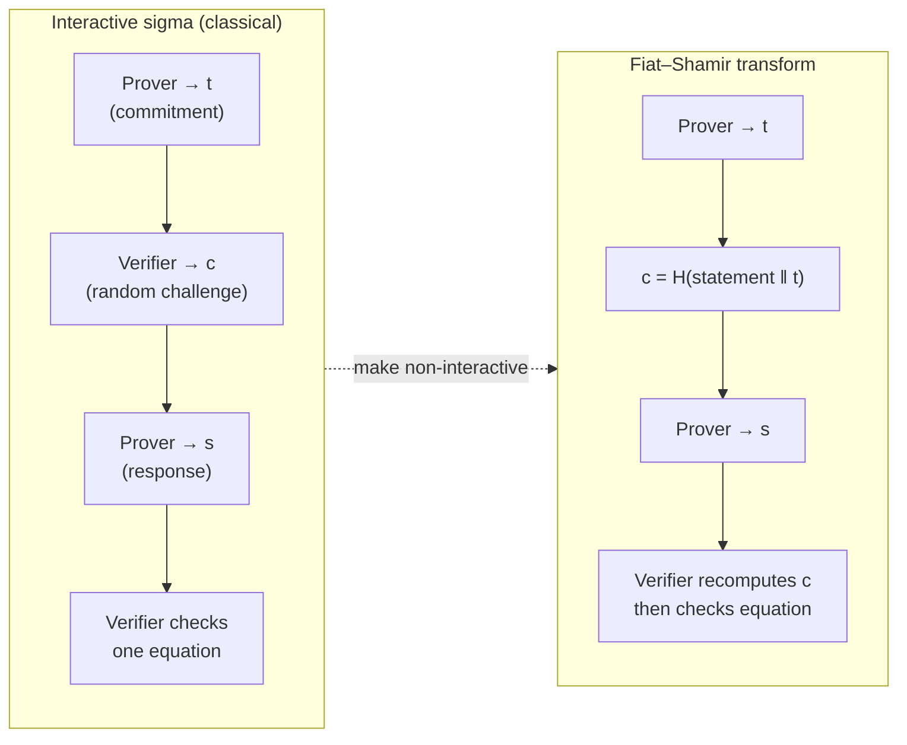
```mermaid
flowchart LR
    subgraph Interactive["Interactive sigma (classical)"]
        A["Prover → t<br/>(commitment)"] --> B["Verifier → c<br/>(random challenge)"]
        B --> C["Prover → s<br/>(response)"]
        C --> D["Verifier checks<br/>one equation"]
    end
    subgraph FS_transform["Fiat–Shamir transform"]
        A2["Prover → t"] --> H["c = H(statement ‖ t)"]
        H --> C2["Prover → s"]
        C2 --> D2["Verifier recomputes c<br/>then checks equation"]
    end
    Interactive -. "make non-interactive" .-> FS_transform
```

### Range proof (the hardest one)

The heart of `range_above` / `range_below` / `non_zero`. To prove `value ∈ [0, 2³²)`, the prover decomposes `value` into 32 bits and proves each bit is 0 or 1 via a two-branch OR of Schnorr proofs.

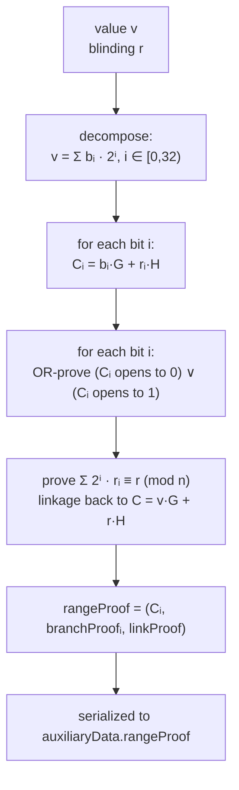
```mermaid
flowchart TB
    V["value v<br/>blinding r"] --> DEC["decompose:<br/>v = Σ bᵢ · 2ⁱ,  i ∈ [0,32)"]
    DEC --> COM["for each bit i:<br/>Cᵢ = bᵢ·G + rᵢ·H"]
    COM --> OR["for each bit i:<br/>OR-prove (Cᵢ opens to 0) ∨ (Cᵢ opens to 1)"]
    OR --> LINK["prove Σ 2ⁱ · rᵢ ≡ r (mod n)<br/>linkage back to C = v·G + r·H"]
    LINK --> OUT["rangeProof = (Cᵢ, branchProofᵢ, linkProof)"]
    OUT --> SER["serialized to auxiliaryData.rangeProof"]
```

### Size and timing

| Primitive           | Size (bytes) | Prove (ms) | Verify (ms) |
|---------------------|-------------:|-----------:|------------:|
| Schnorr (equality)  |           96 |        ~1  |         ~1  |
| k-way OR (membership, k=5) |     ~550 |         ~4 |         ~4  |
| 32-bit range        |        ~3500 |        ~40 |         ~40 |
| Selective disclosure (10 fields) | ~1000 |    ~10 |         ~10 |

Numbers measured on a modern laptop (M2 / Zen 3) in Node.js using `@noble/curves`. Crypto and claim helpers are covered by the **168** unit tests across the repo (including `server/crypto/`, `server/zk-engine.test.ts`, and `shared/claim-consistency.test.ts`).

---

## 13. On-chain vs off-chain data

Every piece of state in Krydo lives in exactly one of three places. The choice is deliberate per-datum:

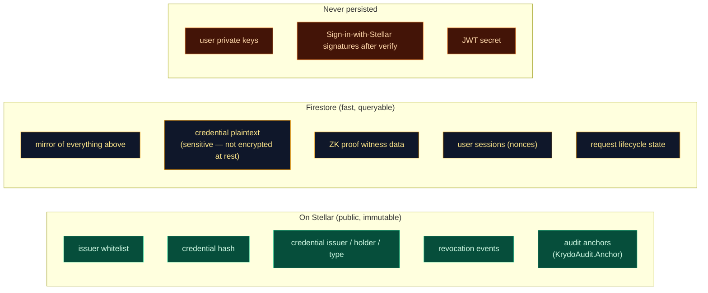
```mermaid
flowchart LR
    subgraph Chain["On Stellar (public, immutable)"]
        C1["issuer whitelist"]
        C2["credential hash"]
        C3["credential issuer / holder / type"]
        C4["revocation events"]
        C5["audit anchors<br/>(KrydoAudit.Anchor)"]
    end
    subgraph DB["Firestore (fast, queryable)"]
        D1["mirror of everything above"]
        D2["credential plaintext<br/>(sensitive — not encrypted at rest)"]
        D3["ZK proof witness data"]
        D4["user sessions (nonces)"]
        D5["request lifecycle state"]
    end
    subgraph Nowhere["Never persisted"]
        N1["user private keys"]
        N2["Sign-in-with-Stellar signatures after verify"]
        N3["JWT secret"]
    end
    classDef chain fill:#064e3b,stroke:#34d399,color:#d1fae5
    classDef db fill:#0f172a,stroke:#f59e0b,color:#fde68a
    classDef never fill:#431407,stroke:#fb923c,color:#fed7aa
    class C1,C2,C3,C4,C5 chain
    class D1,D2,D3,D4,D5 db
    class N1,N2,N3 never
```

### Why mirror on-chain state to Firestore?

| Reason                   | Detail                                                                  |
|--------------------------|-------------------------------------------------------------------------|
| **Query performance**    | "Show me all credentials issued to G...Alice with `expiresAt > now`" is O(1) with a Firestore index; on-chain the same query is O(n) over events. |
| **UI rendering**         | Stellar Expert event logs are not designed for rendering paginated lists. |
| **Composite filters**    | `status=active AND claimType=credit_score AND issuerActive=true` needs secondary indexes the blockchain doesn't provide. |
| **Disaster recovery**    | Losing Firestore only breaks the UI. Every row can be re-derived by replaying `CredentialIssued` events from the contract's first ledger. |

---

## 14. Audit event anchoring

`KrydoAudit` (a Soroban Rust contract) is a generic append-only event log used for off-chain actions that don't warrant their own contract. The emitted `Anchor(sender, kind, id, data, ts)` event can be filtered efficiently by any of the indexed fields.

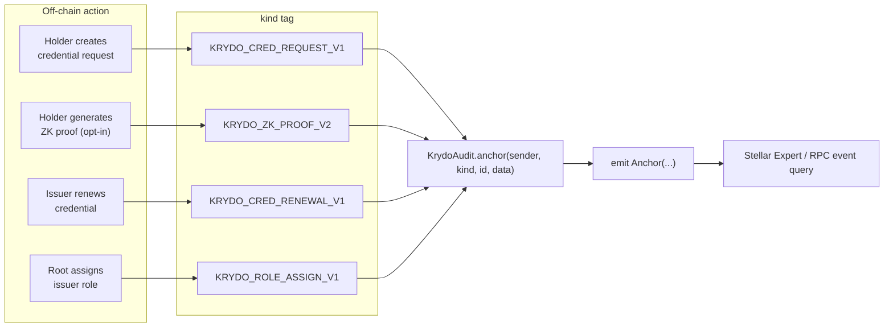
```mermaid
flowchart LR
    subgraph Actions["Off-chain action"]
        A1["Holder creates<br/>credential request"]
        A2["Holder generates<br/>ZK proof (opt-in)"]
        A3["Issuer renews<br/>credential"]
        A4["Root assigns<br/>issuer role"]
    end
    subgraph Tags["kind tag"]
        T1["KRYDO_CRED_REQUEST_V1"]
        T2["KRYDO_ZK_PROOF_V2"]
        T3["KRYDO_CRED_RENEWAL_V1"]
        T4["KRYDO_ROLE_ASSIGN_V1"]
    end
    A1 --> T1
    A2 --> T2
    A3 --> T3
    A4 --> T4
    T1 --> AU["KrydoAudit.anchor(sender, kind, id, data)"]
    T2 --> AU
    T3 --> AU
    T4 --> AU
    AU --> EV["emit Anchor(...)"]
    EV --> IDX["Stellar Expert / RPC event query"]
```

### Decoding an anchor off-chain

The caller passes `kind` as a Soroban symbol, `id` as `Bytes` (a `sha256` id or the credential's `BytesN<32>` hash), and `data` as UTF-8 `Bytes` holding a JSON payload with a known schema per `kind`. Consumers decode with the same schema:

```ts
// "zk" payload layout (as emitted by the client):
JSON.parse(new TextDecoder().decode(data));
// → { commitment, credentialHash, proofType, prover, ts }
```

---

## 15. API surface

Every route is domain-split, Zod-validated, and either `requireAuth` + role-gated or explicitly public. There are no "god" endpoints.

```mermaid
mindmap
  root((/api))
    auth
      GET /nonce
      POST /verify
      POST /refresh
      POST /role-anchor
    issuers
      GET /
      GET /:addr
      POST /
      PATCH /:addr
      DELETE /:addr
    credentials
      GET /
      GET /user/:addr
      GET /issuer/:addr
      GET /:id
      POST /
      PATCH /:id/tx
      PATCH /:id/revoke
      POST /:id/renew
      GET /:id/vc
    credential-requests
      GET /
      GET /user/:addr
      GET /issuer/:addr
      POST /
      PATCH /:id/approve
      PATCH /:id/reject
      POST /:id/anchor
      DELETE /:id
    zk
      GET /proofs/:addr
      GET /proof/:id
      POST /generate
      POST /verify
      POST /:id/anchor
      POST /:id/revoke
      GET /share/:id
    stats
      GET /
      GET /issuer/:addr
    network
      GET /
    health
      GET /healthz
      GET /readyz
```

### Pagination

Every list endpoint supports cursor-based pagination via a shared middleware:

```mermaid
sequenceDiagram
    autonumber
    actor C as Client
    participant S as Krydo API
    participant FS as Firestore

    C->>S: GET /api/credentials?limit=20
    S->>FS: query().orderBy("createdAt").limit(20)
    FS-->>S: 20 docs + lastDoc
    S->>S: encode cursor = base64(lastDoc.id, createdAt)
    S-->>C: { items, nextCursor }
    C->>S: GET /api/credentials?limit=20&cursor=<next>
    S->>FS: query().startAfter(lastDoc).limit(20)
    FS-->>S: next 20 docs
    S-->>C: { items, nextCursor | null }
```

---

## 16. Security layers

Defense in depth is applied at every layer between the socket and the database:

```mermaid
flowchart TB
    subgraph L1["L1 — Transport"]
        HS["HTTPS (HSTS in prod)"]
        HL["Helmet CSP + strict headers"]
        CR["CORS allowlist"]
    end
    subgraph L2["L2 — Per-IP"]
        RL["express-rate-limit<br/>default 100/min"]
        RLS["sensitiveLimiter<br/>10/min for ZK + issuance"]
    end
    subgraph L3["L3 — Session"]
        SW["Sign-in-with-Stellar nonce<br/>+ ed25519 message signature"]
        JW["HS256 JWT<br/>short TTL, rotate on refresh"]
        JS["JWT secret ≥ 32 bytes,<br/>validated at boot"]
    end
    subgraph L4["L4 — Authorization"]
        RA["requireAuth"]
        RR["requireRole('issuer'|'root')"]
        RS["requireSelf(addrParam)<br/>case-sensitive G... match"]
    end
    subgraph L5["L5 — Input"]
        ZB["Zod body/params/query"]
        CS["claim-schemas per type"]
        CC["claim-consistency<br/>(summary vs value)"]
        BJ["boundedJson (size caps)"]
    end
    subgraph L6["L6 — Business"]
        BG["range threshold ≤ claim value"]
        BG2["issuer still whitelisted"]
        BG3["credential not expired / revoked"]
    end
    subgraph L7["L7 — Crypto"]
        SP["sigma protocols verify<br/>(Pedersen + Fiat–Shamir)"]
        EC["verifySep53Message<br/>(SIWS signatures)"]
        KC["sha256 canonicalization"]
    end
    subgraph L8["L8 — Chain"]
        CO["on-chain require_auth(issuer / root)"]
        CR2["CredentialIssued hash uniqueness"]
    end
    subgraph L9["L9 — Data"]
        FP["Firestore security rules<br/>(no direct client access)"]
        NS["no user private keys on server;<br/>DEPLOYER_SECRET only for deploy/root/reads"]
    end
    L1 --> L2 --> L3 --> L4 --> L5 --> L6 --> L7 --> L8 --> L9
```

### Threat model at a glance

| Adversary                                   | Capability                                                   | Mitigation                                   |
|---------------------------------------------|--------------------------------------------------------------|----------------------------------------------|
| Network eavesdropper                        | Reads HTTPS                                                  | TLS + HSTS; no secrets in URLs               |
| Malicious rogue issuer (revoked)            | Tries to issue                                               | `require_auth(issuer)` enforced on-chain      |
| Compromised server                          | Reads Firestore                                              | No user private keys; **credential plaintext is sensitive in Firestore** (encrypt-at-rest is a roadmap item); on-chain hashes/revocations remain ground truth |
| Replayed ZK proof                           | Reuses an old proof against a new challenge                  | Proof TTL + optional challenge binding + anchor freshness |
| Forged Sign-in-with-Stellar signature       | Submits crafted signature                                   | SEP-53 `verifySep53Message`; StrKey compared case-sensitively; nonce one-time use |
| Front-running of issuer revocation          | Issues a credential before revocation lands                  | Credential verify re-checks `is_issuer()` at verification time |

---

## 17. Deployment topology

Krydo runs as a Node/Express API + managed Firestore + three Soroban contracts on Stellar Testnet. Production is typically **Vercel** (serverless `api/` bundle + static client); local/dev can use a single Node process serving the SPA. Render and self-host remain valid alternatives.

```mermaid
flowchart TB
    subgraph CLIENT["User device"]
        BROW["Browser<br/>(React SPA)"]
        MM["Stellar Wallets Kit<br/>(Freighter, xBull, Lobstr, …)"]
    end
    subgraph HOST["Host (Vercel / Node)"]
        APP["Express API<br/>(api/app.bundle.cjs or npm start)"]
        APP -- "serves static /client/dist" --> BROW
        APP -- "GET /healthz" --> HC["liveness probe"]
    end
    subgraph GCP["Google Cloud"]
        FS[("Firestore<br/>native mode")]
        IAM["IAM<br/>service account"]
    end
    subgraph RPCP["Soroban RPC provider"]
        RPC["Soroban RPC endpoint"]
    end
    subgraph SEP["Stellar (Soroban)"]
        KA["KrydoAuthority"]
        KC["KrydoCredentials"]
        KAU["KrydoAudit"]
    end

    BROW -. "HTTPS + JWT" .-> APP
    MM -. "wallet-signed tx" .-> RPC
    APP -- "Admin SDK" --> FS
    APP -- "Soroban RPC" --> RPC
    RPC --> SEP
    IAM --> FS
```

### Configuration gate

The server refuses to boot if any required env var is missing or malformed. See [`server/config.ts`](./server/config.ts).

```mermaid
flowchart LR
    BOOT["npm start / Vercel function"] --> LOAD["load .env"]
    LOAD --> ZOD["Zod validate<br/>(server-config schema)"]
    ZOD -- "invalid" --> FAIL["log readable error<br/>process.exit(1)"]
    ZOD -- "valid" --> INIT["init Firebase admin<br/>init Soroban RPC client<br/>init router"]
    INIT --> READY["LISTEN :5000 / serverless"]
```

Required vars: `JWT_SECRET`, `SESSION_SECRET`, `FIREBASE_PROJECT_ID`, `FIREBASE_SERVICE_ACCOUNT` (or path), `CORS_ORIGINS`. `DEPLOYER_SECRET` is required for contract deploy and preferred for root identity / RPC signing simulation; chain **reads** can work without it when contract IDs are present. Optional: `STELLAR_NETWORK` (default `testnet`), `SOROBAN_RPC_URL` (defaults to the public RPC in `contracts/deployment.json`). See [`.env.example`](./.env.example) for docs. Live demo: [krydo-stellar.vercel.app](https://krydo-stellar.vercel.app).

---

## 18. Observability & operations

```mermaid
flowchart LR
    REQ["incoming request"] --> MW["pino logger middleware"]
    MW --> RID["x-request-id<br/>(uuid v4)"]
    RID --> HNDL["handler"]
    HNDL --> LOG["pino.info / .error<br/>structured JSON"]
    LOG --> STDOUT["stdout"]
    STDOUT --> PF["host logs /<br/>log drain target"]
    HNDL --> METRIC["response latency,<br/>status code"]
    METRIC --> STDOUT
```

### Log fields

Every log line emits:

```
{
  level, time, pid, hostname,
  requestId, method, path, status, durationMs,
  component: "routes/zk" | "auth/jwt" | ...,
  ...context
}
```

Sensitive headers (`authorization`, `cookie`) are redacted automatically.

### Health endpoints

| Endpoint      | Purpose                                          | Response                       |
|---------------|--------------------------------------------------|--------------------------------|
| `GET /healthz`| Liveness — server responded                      | `200 { ok: true }`             |
| `GET /readyz` | Readiness — Firestore + Soroban RPC reachable    | `200 { ready: true, checks }`  |

---

## Further reading

- **Project overview & quick start:** [`README.md`](./README.md)
- **Contributing guide + commit style:** [`CONTRIBUTING.md`](./CONTRIBUTING.md)
- **Security disclosure policy:** [`SECURITY.md`](./SECURITY.md)
- **Deployment specifics (Vercel / Render, indexes):** [`DEPLOY.md`](./DEPLOY.md)
- **Changelog:** [`CHANGELOG.md`](./CHANGELOG.md)

---

<div align="center">

**If a diagram above looks wrong, the code is the source of truth.**
File an issue with the commit hash and the claim and we'll fix the doc.

</div>
