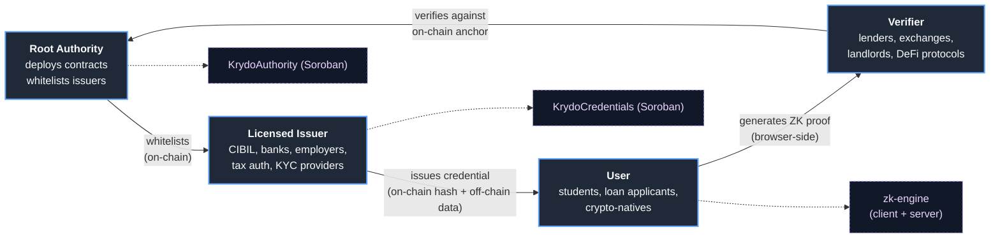
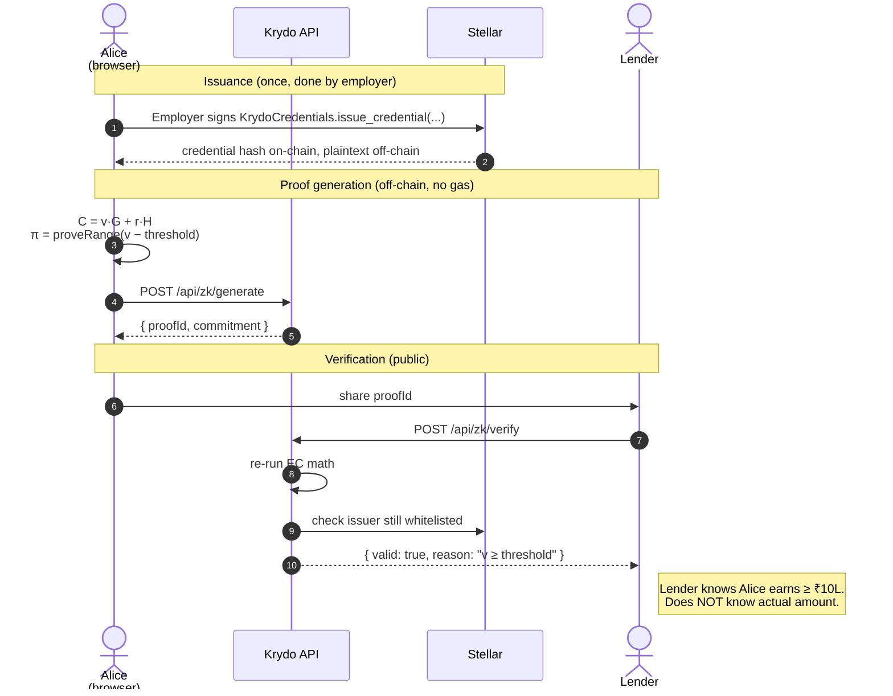
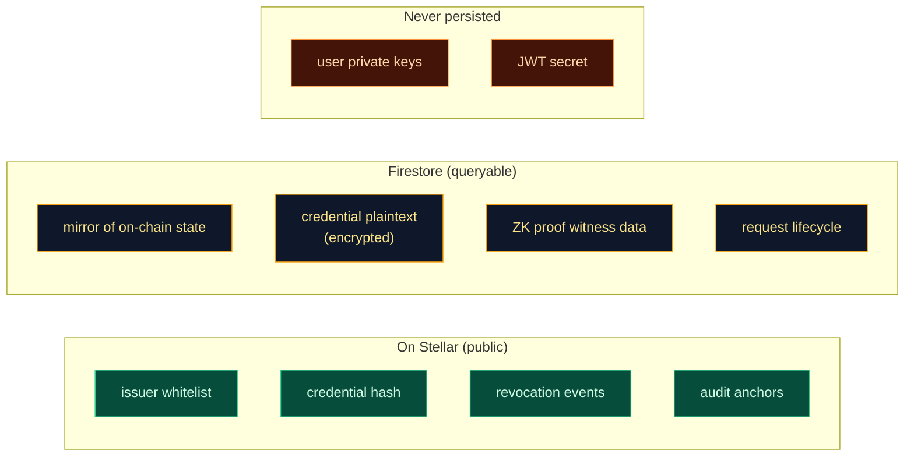

<div align="center">

# Krydo

### Privacy-preserving financial trust infrastructure on Stellar

**Prove you qualify — without revealing what you have.**

[](https://github.com/nishant-uxs/krydo-stellar/actions/workflows/ci.yml)
[](./server/crypto/sigma.test.ts)
[](./LICENSE)
[](https://stellar.expert/explorer/testnet)
[](https://www.typescriptlang.org/)
[](./DOCUMENTATION.md)
[](./SECURITY.md)

**[📖 Full Technical Documentation →](./DOCUMENTATION.md)**

</div>

---

## TL;DR

Krydo is a verifiable-credential system on the Stellar network, running Soroban smart contracts. Issuers sign claims into `KrydoCredentials`; holders keep the plaintext off-chain and prove predicates over it with sigma-protocol zero-knowledge proofs (Pedersen commitments on secp256k1, Fiat–Shamir). A verifier learns whether the predicate holds — `score >= 700`, `income >= 1000000`, `issuer is whitelisted` — not the underlying value.

Three Soroban contracts, one purpose each: `KrydoAuthority` owns the issuer whitelist, `KrydoCredentials` stores credential hashes and revocations, `KrydoAudit` anchors off-chain events. Auth is Sign-in-with-Stellar (a Freighter-signed ed25519 challenge) with a short-lived JWT. The server never holds user secrets; every state-changing action is signed by the acting wallet.

---

## The problem

Current verification flows over-collect by default. A lender asking "do you earn at least ₹10 L?" gets the user's exact salary, employer, six months of bank statements, and often their PAN. That data leaks, gets re-sold, and can't be revoked once it's out.

Zero-knowledge proofs solve the shape of this problem — prove the predicate, not the value — but SNARK-based stacks force circuits, trusted setup, and non-trivial cost. Krydo takes the simpler path: sigma protocols over Pedersen commitments on secp256k1. No setup ceremony, no circuit compiler, proofs generated in the browser in milliseconds, verification in the same API call that fetches the credential — and Stellar's sub-cent fees make anchoring effectively free.

---

## How it works

### The four actors



### End-to-end (income verification)



> **For deeper flows** (Sign-in-with-Stellar auth, credential request lifecycle with wallet rollback, two-phase issuance, sigma-protocol internals, state machines, deployment topology), see **[`DOCUMENTATION.md`](./DOCUMENTATION.md)**.

### What lives where



**Design principle:** blockchain is the source of truth for *what exists* and *who said so*. Firestore is the performance layer for *querying* and *rendering*. Losing Firestore breaks the UI; on-chain truth is intact.

---

## Documentation

| Document                                      | Audience                   | What's in it                                                                  |
|-----------------------------------------------|----------------------------|-------------------------------------------------------------------------------|
| **[`DOCUMENTATION.md`](./DOCUMENTATION.md)**  | engineers, auditors        | 18-section architecture spec with 20+ Mermaid diagrams, full data flows, threat model, protocol internals |
| [`CONTRIBUTING.md`](./CONTRIBUTING.md)        | contributors               | Commit conventions, test bar, PR checklist                                    |
| [`SECURITY.md`](./SECURITY.md)                | security researchers       | Disclosure policy, contact, scope                                             |
| [`DEPLOY.md`](./DEPLOY.md)                    | operators                  | Render Blueprint, Firebase indexes, env-var reference                         |
| [`CHANGELOG.md`](./CHANGELOG.md)              | everyone                   | Release notes                                                                 |

---

## Zero-knowledge proof system

Not SNARKs. Not hash-masking-pretending-to-be-ZK. **Real sigma protocols over Pedersen commitments on secp256k1**, with Fiat–Shamir for non-interactivity.

| Proof type              | Example use case                                   |
|-------------------------|----------------------------------------------------|
| `range_above`           | "credit score ≥ 700"                               |
| `range_below`           | "debt ratio ≤ 40%"                                 |
| `equality`              | "I'm a resident of India"                          |
| `membership`            | "citizenship ∈ {IN, US, UK}"                       |
| `non_zero`              | "I have a PAN number"                              |
| `selective_disclosure`  | "reveal name + employer; hide salary + address"    |

**Security:** soundness + honest-verifier zero-knowledge under the discrete-log assumption on secp256k1. Soundness error ≈ 2⁻²⁵⁶ per protocol step. All primitives live in [`server/crypto/`](./server/crypto/) and are covered by **51 unit tests** (of 154 total).

See [`DOCUMENTATION.md §9–12`](./DOCUMENTATION.md#9-zero-knowledge-proof-system) for protocol details, bit-decomposition, and performance numbers.

---

## Tech stack

| Layer                     | Choice                                                           |
|---------------------------|------------------------------------------------------------------|
| Smart contracts           | Soroban (Rust) on Stellar (`KrydoAuthority`, `KrydoCredentials`, `KrydoAudit`) |
| On-chain library          | `@stellar/stellar-sdk` (Soroban RPC)                            |
| Cryptography              | `@noble/curves` (secp256k1), `@noble/hashes` (SHA-256)           |
| Backend                   | Node 20, Express, TypeScript, Zod, pino, Helmet, jsonwebtoken    |
| Database                  | Firebase Firestore (Admin SDK)                                   |
| Frontend                  | React 18, Vite, TanStack Query, shadcn/ui, Tailwind, wouter      |
| Wallet                    | Freighter (`@stellar/freighter-api`)                            |
| Auth                      | Sign-in-with-Stellar (ed25519 challenge) + JWT (`jsonwebtoken`) |
| Testing                   | Vitest + `@vitest/coverage-v8` (154 tests)                       |
| CI                        | GitHub Actions (Node 20, typecheck + test)                       |

---

## Deployment (Stellar Testnet)

Contract IDs are written to [`contracts/deployment.json`](./contracts/deployment.json) after you run `npm run deploy:contracts`. Once deployed, each `C...` contract ID is browsable on [Stellar Expert](https://stellar.expert/explorer/testnet):

| Contract              | Contract ID (`C...`)                        |
|-----------------------|---------------------------------------------|
| `KrydoAuthority`      | see `contracts/deployment.json`             |
| `KrydoCredentials`    | see `contracts/deployment.json`             |
| `KrydoAudit`          | see `contracts/deployment.json`             |
| Root authority (`G...`) | deployer account, funded via friendbot    |

---

## Quick start

### Prerequisites

- Node.js **20+**
- Rust + the [Stellar CLI](https://developers.stellar.org/docs/tools/cli) (only needed to build/deploy contracts)
- A Firebase project with Firestore enabled + an Admin SDK service-account JSON
- A Stellar testnet account funded via [friendbot](https://friendbot.stellar.org) (for issuer / credential operations)
- The [Freighter](https://freighter.app) browser wallet extension

### Install & run

```bash
git clone https://github.com/nishant-uxs/krydo-stellar.git
cd krydo-stellar
npm install
cp .env.example .env        # fill in values — server validates at boot
npm run dev                 # http://localhost:5000 with HMR
```

Common scripts:

```bash
npm test            # 154 unit tests (~16s)
npm run check       # strict typecheck
npm run build       # production build
npm start           # run built server
```

### Deploy Firestore indexes (one-time)

```bash
# Option A — using the app's own Admin SDK service account
npm run deploy:indexes

# Option B — using firebase-tools with your Google account
npx firebase-tools login --no-localhost
npx firebase-tools deploy --only firestore:indexes --project <your-project-id>
npm run check:indexes   # prints CREATING / READY for each composite index
```

### (Optional) Re-deploy contracts

```bash
npm run compile:contracts    # stellar contract build → contracts/target/…/*.wasm
npm run deploy:contracts     # stellar contract deploy → writes contracts/deployment.json
```

### Deploy to Render

The repo ships with a [`render.yaml`](./render.yaml) Blueprint — push to GitHub, click **New +** → **Blueprint** in Render, fill in the prompted secrets (`FIREBASE_SERVICE_ACCOUNT`, `DEPLOYER_SECRET`, `SOROBAN_RPC_URL`, `CORS_ORIGINS`) and apply. Full walkthrough in [`DEPLOY.md`](./DEPLOY.md).

### Export as W3C Verifiable Credential

```bash
curl https://krydo.onrender.com/api/credentials/<uuid>/vc
```

Returns `application/vc+ld+json` with a `did:pkh:stellar` subject and a Krydo on-chain anchor proof — consumable by Veramo, Ceramic, Walt.id, Microsoft Entra, or anything that speaks the spec.

---

## Project layout

```
krydo-stellar/
├── client/                    # React app (Vite)
├── server/                    # Express API
│   ├── auth/                  # Sign-in-with-Stellar + JWT
│   ├── crypto/                # EC math, Pedersen, sigma protocols
│   ├── routes/                # issuers, credentials, zk, stats, health
│   ├── blockchain.ts          # Soroban RPC + contract wrappers
│   ├── storage.ts             # Firestore abstraction
│   └── zk-engine.ts           # high-level proof types
├── shared/                    # types + contract metadata used by both sides
├── contracts/                 # Soroban Rust workspace + deployment.json
├── render.yaml                # Render Blueprint
└── DOCUMENTATION.md           # ← full architecture spec
```

For the detailed tree and module responsibilities see [`DOCUMENTATION.md §4`](./DOCUMENTATION.md#4-repository-layout).

---

## Security

Defense in depth at nine layers (transport → per-IP → session → authorization → input → business → crypto → chain → data). Every route is Zod-validated, role-gated, and rate-limited. No private keys on the server; every signature happens in the user's wallet.

See [`DOCUMENTATION.md §16`](./DOCUMENTATION.md#16-security-layers) for the full matrix and threat model, and [`SECURITY.md`](./SECURITY.md) for the disclosure policy.

---

## Roadmap

### Shipped

- [x] Real ZK primitives on secp256k1 (Pedersen + sigma protocols)
- [x] Sign-in-with-Stellar authentication + JWT
- [x] Full SSI mode — every on-chain write goes through the user's wallet
- [x] `KrydoAudit` contract for wallet-signed off-chain anchors
- [x] Helmet + CORS + per-IP rate limiting + Zod everywhere
- [x] Structured logging (pino) + request IDs
- [x] Per-claim-type structured Zod schemas
- [x] ZK proof TTL + revocation-aware verification
- [x] Shareable verification URLs (`/api/zk/share/:id`)
- [x] Health + readiness probes (`/healthz`, `/readyz`)
- [x] Issuer analytics (`/api/stats/issuer/:address`)
- [x] Search + filter on credential and issuer lists
- [x] Freighter wallet integration (`@stellar/freighter-api`)
- [x] W3C Verifiable Credentials v2 export
- [x] One-click Render deploy (`render.yaml`)
- [x] 154 unit tests + GitHub Actions CI + coverage artifact

### Next up

- [ ] On-chain Groth16 / PLONK verifier contract (O(1) proof verification)
- [ ] IPFS / Arweave-backed encrypted credential store
- [ ] Multi-sig root authority (Safe contract)
- [ ] On-chain revocation registry for ZK proofs
- [ ] Subgraph for trust-tree history queries

### Known limitations

Krydo is an **MVP on testnet**. Before mainnet you should expect: a third-party cryptographic audit, a multi-sig root, decentralized credential storage, a gas-cost analysis, and SOC-2 / equivalent for the backend. This repo is a solid engineering base, not a production financial product.

---

## Contributing

See [`CONTRIBUTING.md`](./CONTRIBUTING.md) for the full guide. Quick version:

1. Fork + branch (`git checkout -b feat/your-change`)
2. Write tests — every new route needs Zod validation + at least one Vitest spec
3. `npm run check && npm test` must pass
4. Conventional Commits format (`feat(zk):`, `fix(auth):`, …)
5. Open a PR — CI re-runs the same gates

All contributions are reviewed for security first, features second.

**Security disclosures:** please follow [`SECURITY.md`](./SECURITY.md) — do not open public issues for vulnerabilities.

---

## License

[MIT](./LICENSE) © 2026 Krydo contributors

---

<div align="center">

**Built with cryptography, not hype.**

For the deep dive: **[`DOCUMENTATION.md`](./DOCUMENTATION.md)** · Questions? Open an [issue](https://github.com/nishant-uxs/krydo-stellar/issues).

</div>
